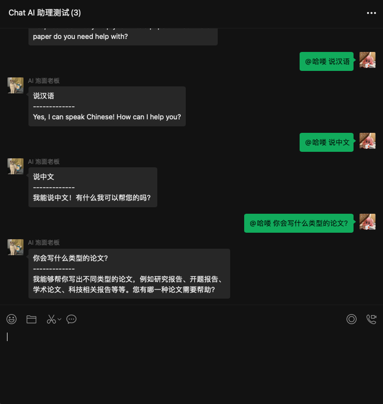

# ChatGPT For ChatBot WeChat

> 快速将 ChatGPT 接入微信，基于 [OpenAI 官方接口](https://platform.openai.com/account/api-keys)，作为私人助理或者微信群助理（注意合理使用）

## 本项目衍生于 [go-zoox/chatgpt-for-chatbot-feishu](https://github.com/go-zoox/chatgpt-for-chatbot-feishu)，欢迎点 Star

* [一、预览](#预览)
* [二、功能支持](#功能支持)
* [三、项目特点](#项目特点)
* [四、部署方案](#部署方案)
  * [一键部署（推荐）](#一键部署（推荐）)
  * [二进制](#二进制)
  * [Docker Compose](#docker-compose)
  * [二次开发](#二次开发)
* [五、更多交流](#更多交流)
* [六、相关资源](#相关资源)

## 预览


## 功能支持

* [x] 支持长对话，自动联系上下文
* [x] 支持私人对话
* [x] 支持群聊
  * [x] 支持 @ 机器人回复
  * [x] 也支持命令（`/chatgpt`）触发，格式：`/chatgpt 你的问题`
* [ ] 支持二次开发，快速接入企业现有应用
  * Go 开发框架
    * [x] [Go-Zoox](https://github.com/go-zoox/zoox)
    * [ ] Gin
    * [ ] Echo
    * [ ] Go-Zero

## 项目特点
* 基于 [OpenAI GPT3](https://platform.openai.com/account/api-keys) 接口，使用 [ChatGPT Client](https://github.com/go-zoox/chatgpt-client)
* 支持 [本地环境](https://dashboard.cpolar.com/login)、[Docker](https://www.docker.com/) 多种渠道部署


## 部署方案

### 一键部署（推荐）

```bash
# 基于服务端管理框架 Zmicro，自动安装缺失依赖，使用 Zmicro Service，底层容器使用 Docker
# 执行下面脚本，并按提示操作，填写微信 APP ID/Secret 和 OpenAI/ChatGPT API Key
$ curl -o- https://raw.githubusercontent.com/zmicro-design/service-chatgpt-for-chatbot-wechat/master/install | bash
```

### 二进制

```bash
# 安装服务器管理框架 Zmicro
$ curl -o- https://raw.githubusercontent.com/zcorky/zmicro/master/install | bash

# 安装 chatgpt-for-chatbot-wechat
$ zmicro package install chatgpt-for-chatbot-wechat

# 准备 OpenAI/ChatGPT API Key
$ export CHATGPT_API_KEY=<YOUR_CHATGPT_API_KEY>

# 运行
$ zmicro chatgpt-for-chatbot-wechat
```

### Docker Compose

```yaml
# docker-compose.yaml
version: "3.7"

services:
  chatgpt-for-chatbot-wechat:
  image: whatwewant/chatgpt-for-chatbot-wechat:latest
  environment:
    CHATGPT_API_KEY: "<YOUR_CHATGPT_API_KEY>"
```

```bash
# 启动
$ docker-compose up -d
```

### 二次开发

```bash
# 支持 Go-Zoox 中间件
```

### 更多交流

可以创建 Issue 或者加微信，备注来自：ChatGPT-For-ChatBot-WeChat，进入微信群沟通

<p align="center">
  
</p>

### 相关资源
* [go-zoox/chatgpt-for-chatbot-feishu](https://github.com/go-zoox/chatgpt-for-chatbot-feishu) - 快速将 ChatGPT 接入飞书，作为私人工作助理或者企业员工助理

* [ChatGPT Client](https://github.com/go-zoox/chatgpt-client) - 一个 Go 语言实现的 ChatGPT Client SDK

* [OpenAI Client](https://github.com/go-zoox/openai-client) - 一个 Go 语言实现的 OpenAI Client SDK

* [Zmicro](https://github.com/zcorky/zmicro) - 一个原生 Shell 实现的、强大的跨平台服务器管理框架，快速开发各种 CLI 插件、服务以及包管理等

* [Zmicro Service | ChatGPT-For-ChatBot-WeChat](https://github.com/zmicro-design/service-chatgpt-for-chatbot-wechat) - ChatGPT-For-ChatBot-WeChat 的 zmicro service 实现

* [Zmicro Package | ChatGPT-For-ChatBot-WeChat](https://github.com/zmicro-design/service-chatgpt-for-chatbot-wechat) - ChatGPT-For-ChatBot-WeChat 的 zmicro package 实现
